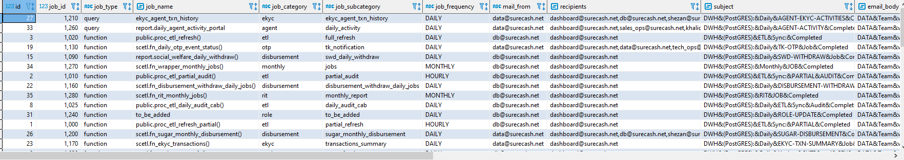
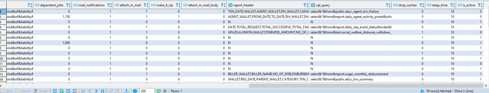

# **ETL**

---

## **Tables**

---

## **daily_dwh_schedule_jobs**

```sql
-- DROP TABLE public.daily_dwh_schedule_jobs;

CREATE TABLE public.daily_dwh_schedule_jobs (
	id bigserial NOT NULL,
	job_id numeric NOT NULL,
	job_type varchar(100) NOT NULL,
	job_name text NOT NULL,
	job_category varchar(100) NOT NULL,
	job_subcategory varchar(100) NOT NULL,
	job_frequency varchar(20) NOT NULL,
	mail_from varchar(100) NOT NULL,
	recipients text NOT NULL,
	subject text NOT NULL,
	email_body text NOT NULL,
	dependent_jobs numeric NOT NULL,
	mail_notifications numeric NULL DEFAULT 1,
	attach_in_mail numeric NULL DEFAULT 0,
	make_it_zip numeric NULL DEFAULT 0,
	attach_in_mail_body numeric NULL DEFAULT 0,
	report_header text NULL DEFAULT 'N'::text,
	sql_query text NULL DEFAULT 'N'::text,
	drop_caches numeric NULL DEFAULT 0,
	sleep_time numeric NOT NULL,
	is_active numeric NULL DEFAULT 1
);
```

**Sample Output**




---

## **t_etl_tables**

---

## **t_daily_jobs_audit**

---

## **daily_db_size**

---

## **t_etl_tables_log**

---


