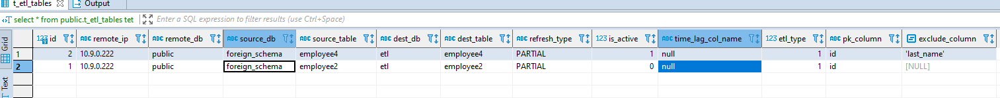

# **Extract, Transform and Load**

---

# **Tables**

---

## **daily_dwh_schedule_jobs**

```sql
-- DROP TABLE public.daily_dwh_schedule_jobs;

CREATE TABLE public.daily_dwh_schedule_jobs (
	id bigserial NOT NULL,
	job_id numeric NOT NULL,
	job_type varchar(100) NOT NULL,
	job_name text NOT NULL,
	job_category varchar(100) NOT NULL,
	job_subcategory varchar(100) NOT NULL,
	job_frequency varchar(20) NOT NULL,
	mail_from varchar(100) NOT NULL,
	recipients text NOT NULL,
	subject text NOT NULL,
	email_body text NOT NULL,
	dependent_jobs numeric NOT NULL,
	mail_notifications numeric NULL DEFAULT 1,
	attach_in_mail numeric NULL DEFAULT 0,
	make_it_zip numeric NULL DEFAULT 0,
	attach_in_mail_body numeric NULL DEFAULT 0,
	report_header text NULL DEFAULT 'N'::text,
	sql_query text NULL DEFAULT 'N'::text,
	drop_caches numeric NULL DEFAULT 0,
	sleep_time numeric NOT NULL,
	is_active numeric NULL DEFAULT 1
);
```

**Sample Output**


---

## **t_etl_tables**

```sql
-- DROP TABLE public.t_etl_tables;

CREATE TABLE public.t_etl_tables (
	id serial NOT NULL,
	remote_ip varchar(50) NULL,
	remote_db varchar(50) NULL,
	source_db varchar(50) NULL,
	source_table varchar(100) NULL,
	dest_db varchar(50) NULL,
	dest_table varchar(100) NULL,
	refresh_type varchar(50) NULL,
	is_active int4 NULL,
	time_lag_col_name varchar(50) NULL,
	etl_type numeric NULL DEFAULT 0,
	pk_column varchar(50) NULL,
	exclude_column text NULL,
	CONSTRAINT t_etl_tables_pkey PRIMARY KEY (id)
);
```

**Sample Output**



---

## **t_daily_jobs_audit**

```sql
-- DROP TABLE public.t_daily_jobs_audit;

CREATE TABLE public.t_daily_jobs_audit (
	id bigserial NOT NULL,
	run_time timestamp NULL DEFAULT CURRENT_TIMESTAMP,
	job_category varchar(100) NOT NULL,
	job_name varchar(100) NOT NULL,
	status varchar(10) NOT NULL,
	error_message text NOT NULL,
	sql_error text NOT NULL
);
```

**Sample Output**


---

## **daily_db_size**

```sql
-- DROP TABLE public.daily_db_size;

CREATE TABLE public.daily_db_size (
	"current_timestamp" timestamptz NULL,
	db_size_mb int8 NULL
);
```

**Sample Output**


---

## **t_etl_tables_log**

```sql
-- DROP TABLE public.t_etl_tables_log;

CREATE TABLE public.t_etl_tables_log (
	id bigserial NOT NULL,
	dest_db varchar(100) NULL,
	dest_table varchar(100) NULL,
	source_db varchar(100) NULL,
	source_table varchar(100) NULL,
	dest_max_id numeric NULL,
	source_max_id numeric NULL,
	dest_new_max_id numeric NULL,
	refresh_type varchar(10) NULL,
	create_date timestamp NOT NULL DEFAULT CURRENT_TIMESTAMP,
	pk_column varchar(50) NULL,
	column_list text NULL,
	CONSTRAINT t_etl_tables_log_pkey PRIMARY KEY (id)
);
```

**Sample Output**


---


