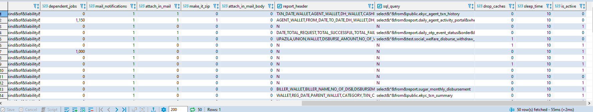

# **Extract, Transform and Load**

---

# **Tables**

---

## **daily_dwh_schedule_jobs**

```sql
-- DROP TABLE public.daily_dwh_schedule_jobs;

CREATE TABLE public.daily_dwh_schedule_jobs (
	id bigserial NOT NULL,
	job_id numeric NOT NULL,
	job_type varchar(100) NOT NULL,
	job_name text NOT NULL,
	job_category varchar(100) NOT NULL,
	job_subcategory varchar(100) NOT NULL,
	job_frequency varchar(20) NOT NULL,
	mail_from varchar(100) NOT NULL,
	recipients text NOT NULL,
	subject text NOT NULL,
	email_body text NOT NULL,
	dependent_jobs numeric NOT NULL,
	mail_notifications numeric NULL DEFAULT 1,
	attach_in_mail numeric NULL DEFAULT 0,
	make_it_zip numeric NULL DEFAULT 0,
	attach_in_mail_body numeric NULL DEFAULT 0,
	report_header text NULL DEFAULT 'N'::text,
	sql_query text NULL DEFAULT 'N'::text,
	drop_caches numeric NULL DEFAULT 0,
	sleep_time numeric NOT NULL,
	is_active numeric NULL DEFAULT 1
);
```

**Sample Output**




---

## **t_etl_tables**

```sql
-- DROP TABLE public.t_etl_tables;

CREATE TABLE public.t_etl_tables (
	id serial NOT NULL,
	remote_ip varchar(50) NULL,
	remote_db varchar(50) NULL,
	source_db varchar(50) NULL,
	source_table varchar(100) NULL,
	dest_db varchar(50) NULL,
	dest_table varchar(100) NULL,
	refresh_type varchar(50) NULL,
	is_active int4 NULL,
	time_lag_col_name varchar(50) NULL,
	etl_type numeric NULL DEFAULT 0,
	pk_column varchar(50) NULL,
	exclude_column text NULL,
	CONSTRAINT t_etl_tables_pkey PRIMARY KEY (id)
);
```

**Sample Output**


```sql
update public.t_etl_tables
    set exclude_column = '''last_name'''
where id = 2;
```

---

## **t_daily_jobs_audit**

```sql
-- DROP TABLE public.t_daily_jobs_audit;

CREATE TABLE public.t_daily_jobs_audit (
	id bigserial NOT NULL,
	run_time timestamp NULL DEFAULT CURRENT_TIMESTAMP,
	job_category varchar(100) NOT NULL,
	job_name varchar(100) NOT NULL,
	status varchar(10) NOT NULL,
	error_message text NOT NULL,
	sql_error text NOT NULL
);
```

**Sample Output**


---

## **daily_db_size**

```sql
-- DROP TABLE public.daily_db_size;

CREATE TABLE public.daily_db_size (
	"current_timestamp" timestamptz NULL,
	db_size_mb int8 NULL
);
```

**Sample Output**


---

## **t_etl_tables_log**

```sql
-- DROP TABLE public.t_etl_tables_log;

CREATE TABLE public.t_etl_tables_log (
	id bigserial NOT NULL,
	dest_db varchar(100) NULL,
	dest_table varchar(100) NULL,
	source_db varchar(100) NULL,
	source_table varchar(100) NULL,
	dest_max_id numeric NULL,
	source_max_id numeric NULL,
	dest_new_max_id numeric NULL,
	refresh_type varchar(10) NULL,
	create_date timestamp NOT NULL DEFAULT CURRENT_TIMESTAMP,
	pk_column varchar(50) NULL,
	column_list text NULL,
	CONSTRAINT t_etl_tables_log_pkey PRIMARY KEY (id)
);
```

**Sample Output**


---

---

# **Functions**

---

## **public.proc_etl_refresh_partial()**

---

```sql
CREATE OR REPLACE FUNCTION public.proc_etl_refresh_partial()
 RETURNS void
 LANGUAGE plpgsql
AS $function$
DECLARE
	rec   				record;
   	dest_max_id 		BIGINT;
   	source_max_id 		BIGINT;
   	dest_new_max_id 	BIGINT;
  
    -- EXCEPTION
	v_error_msg 		TEXT;
  	v_column_list		TEXT; 
  	v_sql				TEXT;
BEGIN
	FOR rec IN
		SELECT *
	  	FROM public.t_etl_tables
	  	WHERE is_active=1 AND refresh_type='PARTIAL'
	  	ORDER BY id
	
	-- LOOP STARTS
	LOOP  
	
	RAISE NOTICE '';
    RAISE NOTICE 'Process Started....';
   
	-- SHOWING THE COLUMN LIST OF PULLED TABLE
   	IF rec.exclude_column IS NULL THEN 	-- IF NO COLUMN IS EXCLUDED
	   v_sql := 'SELECT 
					STRING_AGG(column_name, '', '') as column_list
				from
				(
					SELECT column_name, ordinal_position 
					FROM information_schema.columns 
					WHERE table_schema = '''|| rec.dest_db ||''' 
					AND table_name = '''|| rec.dest_table ||'''					
					ORDER BY ordinal_position
				)v';
   	ELSE    							-- IF COLUMNS ARE EXCLUDED (COLUMNS ARE COMMA SEPARATED WITH STRING TYPE)
	   v_sql := 'SELECT 
					STRING_AGG(column_name, '', '') as column_list
				from
				(
					SELECT column_name, ordinal_position 
					FROM information_schema.columns 
					WHERE table_schema = '''|| rec.dest_db ||''' 
					AND table_name = '''|| rec.dest_table ||'''
					AND column_name not in ('|| rec.exclude_column ||')
					ORDER BY ordinal_position
				)v';
   	END IF;
  
   	EXECUTE v_sql INTO v_column_list;
  	RAISE NOTICE 'Column List= %',v_column_list;
  	
  	-- TRUNCATE TABLE IF FULL TABLE RELOAD
	IF rec.refresh_type = 'FULL'	-- POINTER
	THEN
		EXECUTE 'TRUNCATE TABLE ' || rec.dest_db || '.' || rec.dest_table ;
	END IF;
	
	-- Finding MAX ID of 'dest_db.dest_table' [if truncate then dest_max_id = 0]
	EXECUTE 'SELECT COALESCE(MAX('|| rec.pk_column ||'), 0) FROM ' || rec.dest_db || '.' || rec.dest_table INTO dest_max_id;
	 
	source_max_id := dest_max_id+1300000; -- POINTER why source_max_id is limited to 13lac? if more than 13lac data ?
	
	IF dest_max_id < source_max_id -- TRUE ALWAYS ??
	THEN
		IF rec.etl_type=1 THEN	-- FULL INSERT
			RAISE NOTICE 'Insertion Started: %.%', rec.dest_db,rec.dest_table;
			EXECUTE 'INSERT INTO ' || rec.dest_db || '.' || rec.dest_table || '('||v_column_list||') SELECT '||v_column_list||' FROM '|| rec.source_db ||'.' || rec.source_table || ' WHERE '|| rec.pk_column ||' >' || dest_max_id  ; -- INSERT ALL ROWS EVEN IF MORE THAN 13LAC
		ELSE 					-- BULK INSERTION
			RAISE NOTICE 'Bulk Insertion Started: %.%', rec.dest_db,rec.dest_table;
			EXECUTE 'SELECT * FROM public.bulk_etl_insert_limit(''' || rec.dest_table || ''',''' || rec.source_table || ''',' || dest_max_id || ',' || source_max_id || ',''' || rec.time_lag_col_name || ''',''' || rec.dest_db || ''', ''' || rec.source_db || ''', ''' || rec.pk_column || ''', ''' || v_column_list || ''')';
		END IF;
	
		-- Finding MAX ID of 'dest_new_max_id'
		EXECUTE 'SELECT COALESCE(MAX('|| rec.pk_column ||'), 0) FROM ' || rec.dest_db || '.' || rec.dest_table INTO dest_new_max_id;
		RAISE NOTICE 'dest_max_id: %, dest_new_max_id: %, | Rows Inserted: ==> %', dest_max_id, dest_new_max_id, dest_new_max_id-dest_max_id;
		
		RAISE NOTICE 'Inserting into public.t_etl_tables_log';
		EXECUTE 'INSERT INTO public.t_etl_tables_log (dest_db, dest_table, source_db, source_table, dest_max_id, source_max_id, dest_new_max_id, refresh_type, pk_column, column_list) values (''' || rec.dest_db || ''',''' || rec.dest_table || ''',''' || rec.source_db || ''',''' || rec.source_table || ''',' || dest_max_id || ',' || source_max_id || ',' || dest_new_max_id || ',''' || rec.refresh_type ||''', ''' || rec.pk_column ||''',''' || v_column_list ||''')';	
   	END IF;
  
   	END LOOP;
  	-- LOOP ENDS
  	
   	RAISE NOTICE 'Inserting Current Growth of DB';
   	INSERT INTO public.daily_db_size SELECT CURRENT_TIMESTAMP, pg_database_size('postgres')/1024/1024 AS db_size_mb;

	RAISE NOTICE '---------DONE------------';
   	RAISE NOTICE '';
   
	EXCEPTION WHEN OTHERS THEN
		GET STACKED DIAGNOSTICS v_error_msg = PG_EXCEPTION_CONTEXT;
		-- INSERT LOG IF ANY ERRORS
		INSERT INTO	public.t_daily_jobs_audit(job_category, job_name, status, error_message, sql_error) VALUES('ETL','scetl.proc_etl_refresh_partial()','FAILED', v_error_msg, SQLERRM);

END; 
$function$
;

-- Permissions
ALTER FUNCTION public.proc_etl_refresh_partial() OWNER TO postgres;
GRANT ALL ON FUNCTION public.proc_etl_refresh_partial() TO public;
GRANT ALL ON FUNCTION public.proc_etl_refresh_partial() TO postgres;
```

---

## **public.bulk_etl_insert_limit(text, text, numeric, numeric, text, text, text, text, text)**

---

```sql
CREATE OR REPLACE FUNCTION public.bulk_etl_insert_limit(text, text, numeric, numeric, text, text, text, text, text)
 RETURNS void
 LANGUAGE plpgsql
AS $function$
/*
 * 	public.bulk_etl_insert_limit(dest_table, source_table, dest_max_id, source_max_id, time_lag_col_name, dest_db, source_db, pk_column, column_list)
 * 	public.bulk_etl_insert_limit(	     $1, 		   $2, 			$3, 		   $4, 				  $5, 	   $6, 		  $7, 		 $8, 		  $9)
 * 
 * */ 
DECLARE
    d 				NUMERIC	:= 0;
   	v_max_src_id	BIGINT 	:= 0;
   	v_max_loop		BIGINT 	:= 0;
   
BEGIN
	d := $3;	-- dest_max_id

	EXECUTE 'SELECT COALESCE(max('|| $8 ||'), 0) FROM ' ||  $7 || '.' ||$2||' where ' || $8 || ' >' || $3 || ' AND ' || $8 || ' <= ' ||$4||'' INTO v_max_src_id;
	RAISE NOTICE 'v_max_src_id= %', v_max_src_id ;
	-- if row have more than 13lac ? -- why pk_column <= max_dest_id+13lac (source_max_id) ?
	-- If more than 13lac data then next time pulled the remaining data?

	EXECUTE 'SELECT LEAST('||v_max_src_id||', '||$4||')+10' INTO v_max_loop;
	RAISE NOTICE 'v_max_loop= %', v_max_loop;
	-- here v_max_src_id < source_max_id   ==> ALWAYS TRUE 
	-- why not 'SELECT v_max_src_id into v_max_loop'?

	-- STARTS LOOP
	LOOP
		IF $5 = 'null' THEN -- NO TIME LAG COLUMN
			EXECUTE 'INSERT INTO ' || $6 || '.' || $1 || '('||$9||') SELECT '||$9||' FROM ' || $7 || '.' || $2 || ' WHERE ' || $8 || ' >' || d || ' AND ' || $8 || ' <= ' || d+10000 ; -- 10k per batch
		ELSE				-- HAVING TIME LAG COLUMN	
			EXECUTE 'INSERT INTO ' || $6 || '.' || $1 || '('||$9||') SELECT '||$9||' FROM ' || $7 || '.' || $2 || ' WHERE ' || $8 || ' >' || d || ' AND ' || $8 || ' <= ' || d+10000 || ' AND ' || $5 || ' <= NOW()::timestamp - interval ''15 minutes''';
	    END IF;
		d := d + 10000;
		EXIT WHEN d > v_max_loop;  -- $4 :: EXIT WHEN NO MORE ROWS 
	END LOOP;
	-- ENDS LOOP

END
$function$
;

-- Permissions

ALTER FUNCTION public.bulk_etl_insert_limit(text,text,numeric,numeric,text,text,text,text,text) OWNER TO postgres;
GRANT ALL ON FUNCTION public.bulk_etl_insert_limit(text,text,numeric,numeric,text,text,text,text,text) TO public;
GRANT ALL ON FUNCTION public.bulk_etl_insert_limit(text,text,numeric,numeric,text,text,text,text,text) TO postgres;
```

---

